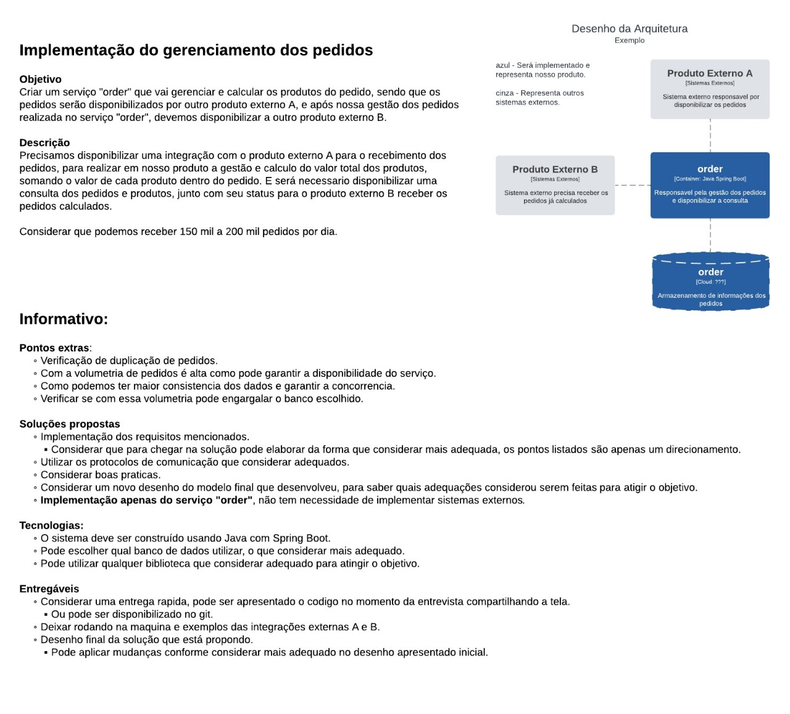
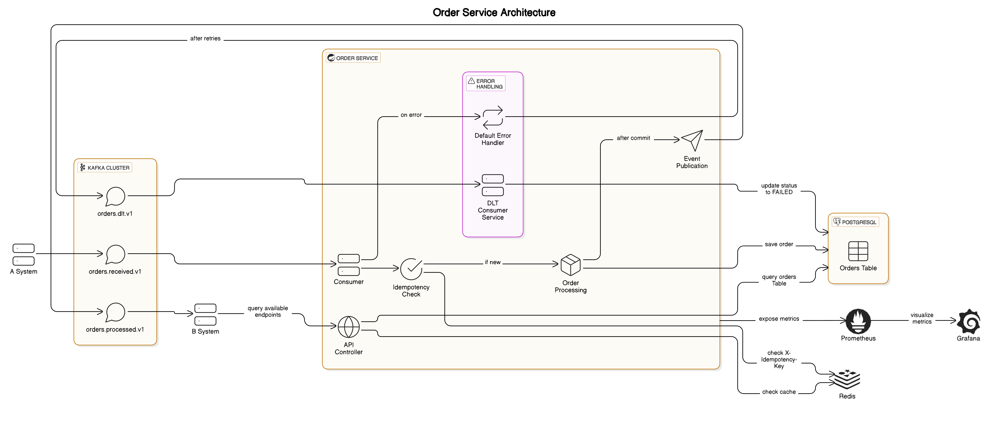
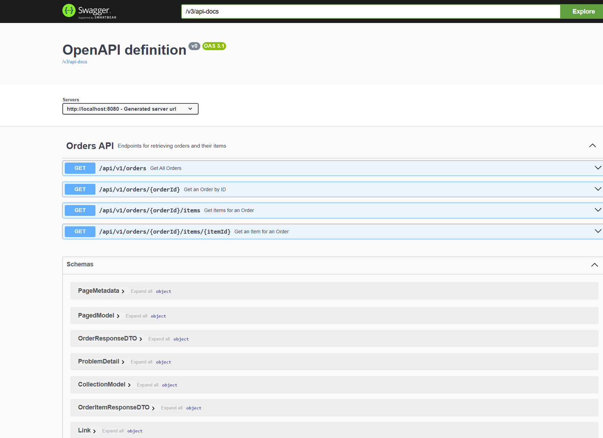
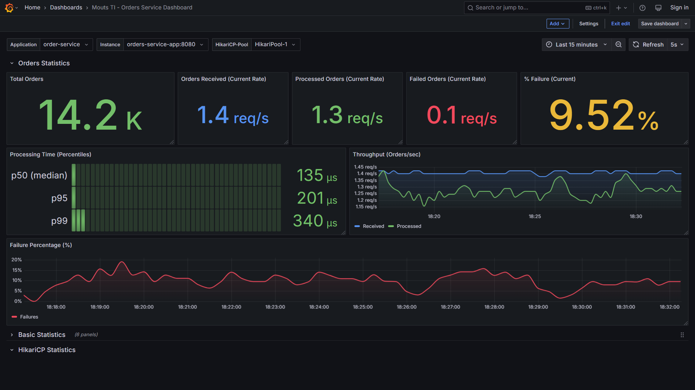

# Order Service - Desafio Backend Mouts TI

Este projeto implementa o `order-service`, uma solução de microsserviço desenvolvida como parte do desafio proposto pela Mouts TI.



## Descrição do Desafio

1.  Receber pedidos de um sistema externo "A".
2.  Garantir o processamento **idempotente** das mensagens recebidas.
3.  Processar o pedido, calculando o valor total e gerenciando seu status.
4.  Persistir os dados do pedido e seus itens em um banco de dados.
5.  Notificar um sistema externo "B" sobre pedidos processados.
6.  Expor uma **API RESTful** para consulta de pedidos e seus itens.

## Funcionalidades Implementadas

- Consumo de mensagens do Kafka (tópico `orders.received.v1`).
- Validação da presença de Chave de Idempotência (`X-Idempotency-Key`) no header Kafka.
- Verificação de Idempotência usando Redis (`SETNX`) para prevenir processamento duplicado.
- Mapeamento de DTOs (Data Transfer Objects) para Entidades de Domínio usando MapStruct.
- Processamento de Pedido: cálculo de valor total, gestão de status (`RECEIVED`, `PROCESSING`, `PROCESSED`, `FAILED`).
- Persistência em PostgreSQL via Spring Data JPA (incluindo controle de concorrência otimista com `@Version`).
- Publicação de Eventos Pós-Commit: Utiliza `ApplicationEventPublisher` e `@TransactionalEventListener(phase = AFTER_COMMIT)` para enviar um evento ao Kafka (para o Sistema B) somente após a transação de banco que processou o pedido ser commitada com sucesso, prevenindo rollbacks indesejados devido a falhas na publicação.
- API RESTful:
  - `GET /api/v1/orders/{orderId}`: Recupera detalhes de um pedido (com links HATEOAS).
  - `GET /api/v1/orders/{orderId}/items`: Recupera os itens de um pedido específico (com link HATEOAS).
  - `GET /api/v1/orders/{orderId}/items/{itemId}`: Recupera os detalhes de um item dentro de um pedido (com links HATEOS)
- Documentação Interativa da API via Swagger UI (`/swagger-ui.html`).
- Cache de API com Redis para os endpoints `GET /api/v1/orders/...` via Spring Cache (`@Cacheable`).
- Tratamento de Erros no Consumidor Kafka:
  - Retentativas automáticas com backoff exponencial (`DefaultErrorHandler`).
  - Envio para Dead Letter Topic (DLT - `orders.dlt.v1`) após falha nas retentativas (`DeadLetterPublishingRecoverer`).
  - Consumidor para a DLT (`DltConsumerService`) que tenta registrar a falha final no banco de dados (marcando como `FAILED`).
- Observabilidade:
  - Métricas da aplicação e de negócio (Micrometer) expostas para Prometheus (`/actuator/prometheus`).
  - Health Checks (Actuator) para verificar o status da aplicação e dependências (`/actuator/health`).
- Dockerização: `Dockerfile` e `docker-compose.yml` para ambiente de desenvolvimento completo (App + Postgres + Redis + Kafka + Zookeeper + Prometheus + Grafana).
- Testes: Cobertura com testes unitários (Mockito) e de integração (`@DataJpaTest`, `@WebMvcTest`, `@SpringBootTest` com `@EmbeddedKafka`).

## Tecnologias Utilizadas

- **Linguagem/Framework:** Java 17+, Spring Boot 3.x
- **Build:** Apache Maven
- **Banco de Dados:** PostgreSQL 17
- **Cache/Idempotência:** Redis 7
- **Mensageria:** Apache Kafka
- **Persistência:** Spring Data JPA / Hibernate
- **Mensageria (Cliente):** Spring Kafka
- **API REST:** Spring Web MVC, Spring HATEOAS
- **Documentação API:** Springdoc OpenAPI (Swagger UI)
- **Cache:** Spring Cache Abstraction
- **Observabilidade:** Spring Boot Actuator, Micrometer (Prometheus Registry)
- **Testes:** JUnit 5, Mockito and H2 Database (para testes JPA)
- **Containerização:** Docker, Docker Compose

## Arquitetura Proposta



## Decisões de Design Relevantes

<details>
<summary><strong>Algumas escolhas foram feitas para garantir robustez, manutenibilidade e aderência às boas práticas:
</strong></summary>

### 1. Chaves de Idempotência

- **Chave de Idempotência (`Idempotency Key`):** É um identificador único, geralmente gerado pelo _cliente_ (ou produtor da mensagem), que acompanha uma requisição ou mensagem específica. O objetivo é permitir que o _servidor_ (ou consumidor da mensagem) detecte se já processou aquela operação específica antes.
- **Como Funciona:**
  1. O cliente gera uma chave única (ex: um UUID) para uma operação e a envia (ex: em um header HTTP como `Idempotency-Key` ou um header de mensagem Kafka como `X-Idempotency-Key`).
  2. O servidor, ao receber a requisição/mensagem, extrai a chave.
  3. Antes de executar a operação principal, ele verifica se já viu essa chave antes (geralmente consultando um armazenamento rápido como Redis ou uma tabela no banco).
  4. **Se a chave é nova:** O servidor armazena a chave (marcando-a como "em processamento"), executa a operação, e ao final, armazena o resultado/status associado à chave (marcando-a como "concluída").
  5. **Se a chave já existe:** O servidor não re-executa a operação. Ele pode retornar o resultado/status armazenado anteriormente (se aplicável) ou simplesmente confirmar o recebimento sem executar novamente os efeitos colaterais.
- **Neste Projeto:** É utilizado o header `X-Idempotency-Key` nas mensagens Kafka e o Redis (com o comando atômico `SETNX`) para armazenar o estado (`PROCESSING`, `PROCESSED`, etc) de cada chave recebida, garantindo que cada pedido seja processado apenas uma vez.
  1. Esta fora do escopo deste projeto, no entanto, uma abordagem comum seria o sistema A calcular um hash baseado nos detalhes imutáveis do pedido (como uma combinação dos identificadores de produto, suas quantidades, preço unitário, etc) para garantir que tentativas repetidas de enviar o _mesmo_ pedido resultem sempre na _mesma_ chave de idempotência.

### 2. Publicação Confiável de Eventos (AFTER_COMMIT)

- **O Problema:** Após processar um pedido e salvá-lo com sucesso no banco de dados (dentro de uma transação `@Transactional`), precisávamos notificar o Sistema B via Kafka. Uma abordagem mais simples seria chamar `kafkaTemplate.send()` diretamente no final do método `@Transactional` do `OrderServiceImpl`.
- **O Risco da Chamada Direta:** A chamada `kafkaTemplate.send()` se tornaria parte da transação do banco. Se essa chamada falhasse (por exemplo, se o broker Kafka estivesse temporariamente indisponível), ela lançaria uma exceção. Essa exceção, ocorrendo dentro do escopo `@Transactional`, causaria o **ROLLBACK** da transação inteira do banco de dados. Consequentemente, o pedido, mesmo tendo sido processado e salvo com sucesso momentos antes, seria desfeito no banco. O estado do pedido seria perdido devido a uma falha em notificar um sistema externo.
- **A Solução Escolhida:** Utilizar o mecanismo de eventos internos do Spring desacoplado da transação principal:
  1. Dentro do método `@Transactional` `processIncomingOrder`, após o `orderRepository.save()` ser bem-sucedido, é publicado um evento simples do Spring (`OrderProcessedSpringEvent`) usando `ApplicationEventPublisher`.
  2. Foi criado um componente separado (`OrderProcessedEventListener`) com um método anotado com `@TransactionalEventListener(phase = TransactionPhase.AFTER_COMMIT)`.
  3. A anotação com `phase = TransactionPhase.AFTER_COMMIT` garante que este método listener só será invocado pelo Spring **depois** que a transação principal (onde o evento foi publicado) for **commitada com sucesso** no banco de dados.
  4. Dentro deste listener, é realizado a chamada `kafkaTemplate.send()` para notificar o Sistema B.
  5. **Benefício:** Se a transação do banco falhar, o evento nunca é enviado. Se a transação do banco for bem-sucedida, _então_ tentamos enviar ao Kafka. Se o envio ao Kafka falhar _neste ponto_, ele **não afeta** a transação do banco que já foi commitada. O pedido permanece salvo como `PROCESSED`. A falha fica isolada na etapa de notificação. Isso garante a consistência do estado do pedido no nosso serviço.

### 3. API REST e HATEOAS

- Foi fornecida uma API REST padrão para permitir a consulta externa dos pedidos processados (`GET /api/v1/orders/{orderId}`) e seus itens respectivos itens, utilizando Spring Web MVC.
- **HATEOAS** foi incorporado nas respostas da API através da inclusão de links (`_links`, usando Spring HATEOAS). O objetivo principal é tornar a API mais auto-descritiva e permitir que os clientes naveguem entre recursos e ações relacionadas usando os links fornecidos na resposta, em vez de depender de URLs codificadas fixamente no cliente.
- **Benefício na Otimização de Carga:** Uma vantagem prática dessa abordagem, especialmente na forma como foi implementada aqui, é a otimização de carga. Ao consultar um pedido específico (`GET /api/v1/orders/{orderId}`), a resposta inclui os dados principais do pedido e um **link** (`rel="items"`) para obter a lista de itens, em vez de **embutir (embed)** a lista completa de itens diretamente na resposta principal. Isso resulta em:
  1. **Payload Menor:** A resposta inicial para `/api/v1/orders/{orderId}` é mais leve, consumindo menos banda de rede.
  2. **Carregamento Sob Demanda (Deferred Loading):** O cliente só buscará os detalhes dos itens (fazendo uma segunda requisição para a URL fornecida no link "items") se e quando realmente precisar deles. Isso evita o processamento e a transferência de dados potencialmente grandes (listas de itens) que podem não ser necessários para todos os casos de uso do cliente.
  3. **Redução de Carga no Backend (Inicial):** A consulta inicial no backend para `/api/v1/orders/{orderId}` pode ser mais simples e rápida, pois não precisa necessariamente carregar/fazer join com todos os itens associados. A carga de buscar os itens é adiada para a requisição específica `/api/v1/orders/{orderId}/items`.
  4. **Melhor Eficiência de Cache:** É potencialmente mais eficiente cachear respostas menores e mais focadas (como os dados principais do pedido) do que respostas grandes que incluem todos os dados relacionados.

### 4. Cache de API

- Redis é utilizado com a abstração do Spring Cache (`@Cacheable`) nos métodos de leitura do serviço (`findOrderById`, `findOrderItemsByOrderId` e `findById`) para armazenar resultados em cache.
- Isso reduz a carga no banco de dados e melhora o tempo de resposta para consultas repetidas aos mesmos pedidos. A invalidação (se necessária por atualizações futuras) seria feita com `@CacheEvict` ou `@CachePut`.
  hash

### 5. Observabilidade (Métricas/Health)

- O foco da observabilidade nesta implementação foi fornecer **Métricas** essenciais (contadores de eventos, timers de processamento) via Micrometer, expostas para **Prometheus** através do endpoint `/actuator/prometheus`.
- **Health Checks** via Actuator (`/actuator/health`) também foram habilitados para monitorar o status da aplicação e suas conexões com dependências (Banco, Redis, Kafka).

</details>

## Pré-requisitos (Para Rodar Localmente)

- Java JDK 17+
- Maven 3.8+ (ou Gradle equivalente)
- Docker & Docker Compose

## Configuração

As configurações principais da aplicação estão em `src/main/resources/application.yml`:

- `spring.application.name`
- `spring.datasource.*` (PostgreSQL)
- `spring.data.redis.*` (Redis)
- `spring.kafka.consumer.*` (Kafka Consumer)
- `spring.kafka.producer.*` (Kafka Producer)
- `spring.cache.*` (Cache Redis)
- `app.kafka.*` (Nomes dos Tópicos Kafka)
- `management.*` (Actuator Endpoints)

Ao rodar via `docker-compose.yml`, as configurações de conexão são **sobrescritas** por variáveis de ambiente para apontar para os containers.

## Como Construir

Use o Maven Wrapper (ou seu Maven local):

`./mvnw clean package -DskipTests`

O JAR executável será gerado em `target/order-service-*.jar`.

## Como Executar

### Opção 1: Usando Docker Compose (Recomendado)

Esta é a forma mais fácil de rodar a aplicação com todas as suas dependências.

1.  **Construir a Imagem e Subir os Containers:**

    - Na raiz do projeto, execute: `docker-compose up --build`

2.  **Acessando os Serviços (Portas Padrão):**

    - **Order Service API:** `http://localhost:8080`
    - **Swagger UI:** `http://localhost:8080/swagger-ui.html`
    - **Actuator Health:** `http://localhost:8080/actuator/health`
    - **Actuator Prometheus:** `http://localhost:8080/actuator/prometheus`
    - **Prometheus UI:** `http://localhost:9090`
    - **Grafana UI:** `http://localhost:3000` (Login anônimo habilitado)
    - **Kafka Broker:** `localhost:9092` (para ferramentas externas)
    - **PostgreSQL:** `localhost:5432` (user/pass/db do compose)
    - **Redis:** `localhost:6379`

3.  **Parando os Serviços:**
    - Pressione `Ctrl+C` no terminal onde `docker-compose up` está rodando.
    - Ou, se estiver rodando em background (`-d`), execute `docker-compose down` na raiz do projeto.
    - Para remover também os volumes (dados): `docker-compose down -v`.

### Opção 2: Rodando Localmente (Sem Docker)

1.  Inicie instâncias locais de PostgreSQL, Redis, Kafka (com Zookeeper).
2.  Crie o banco de dados `orders_db` e os tópicos Kafka `orders.received.v1`, `orders.processed.v1`, `orders.dlt.v1`.
3.  Configure `application.yml` para apontar para suas instâncias locais.
4.  Execute a Aplicação:
    - Via JAR: `java -jar target/order-service-*.jar`
    - Via IDE: Execute a classe principal `OrderServiceApplication`.

## Documentação da API (Swagger UI)

A documentação interativa da API REST está disponível via Swagger UI:

- **URL:** `http://localhost:8080/swagger-ui.html`



## Estrutura das Respostas da API (HAL+JSON)

As respostas da API REST deste serviço seguem os princípios HATEOAS com o Content-Type `application/hal+json`.

O formato HAL estrutura a resposta JSON com três componentes principais:

1.  **Estado do Recurso:** Os campos de dados do recurso solicitado (ex: `id`, `status`, `total`, etc).
2.  **Links (`_links`):** Um objeto JSON contendo links para recursos relacionados ou ações possíveis.

Abaixo estão exemplos da estrutura para os endpoints implementados:

### Exemplo: Resposta para `GET /api/v1/orders/{orderId}`

Retorna os detalhes de um pedido específico, incluindo links para si mesmo e para a coleção de itens associada.

```json
{
  "id": "61af51a5-130f-4387-b97e-59ce1882218b",
  "idempotencyKey": "ea8072fa-9a74-4a0d-85d1-60c7dfaa4ccd",
  "status": "PROCESSED",
  "total": 46.0,
  "createdAt": "2025-04-02T19:37:39.721938",
  "processedAt": "2025-04-02T19:37:39.721938",
  "_links": {
    "self": {
      "href": "http://localhost:8080/api/v1/orders/61af51a5-130f-4387-b97e-59ce1882218b"
    },
    "items": {
      "href": "http://localhost:8080/api/v1/orders/61af51a5-130f-4387-b97e-59ce1882218b/items"
    }
  }
}
```

## Observabilidade

- **Health Check:** `http://localhost:8080/actuator/health` (Verifique status `UP` e detalhes dos componentes).
- **Métricas (Prometheus):** `http://localhost:8080/actuator/prometheus` (Verifique métricas como `orders_received_total`, `http_server_requests_seconds_count`, etc.).
- **Visualização (Grafana):** `http://localhost:3000` (Configure datasource Prometheus apontando para `http://prometheus:9090`).


